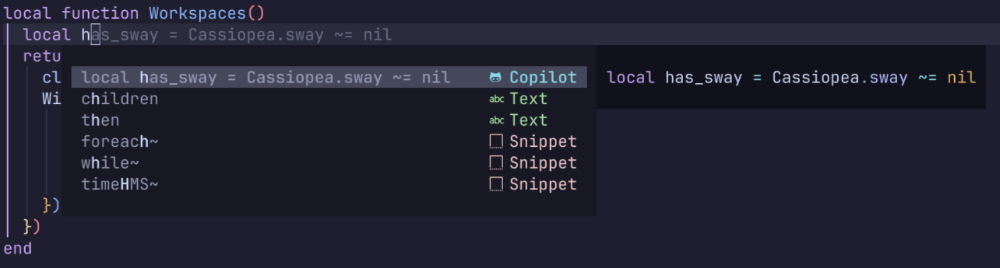

# blink-cmp-copilot

Adds copilot suggestions as a source for [Saghen/blink.cmp](https://github.com/Saghen/blink.cmp)

## Setup

If you already have copilot.lua installed, you can install this plugin with packer as you would any other with the following code:

### Install

#### Lazy

```lua
{
  "giuxtaposition/blink-cmp-copilot",
}

```

#### Packer

```lua
use {
  "giuxtaposition/blink-cmp-copilot",
  after = { "copilot.lua" },
}
```

If you do not have copilot.lua installed, go to https://github.com/zbirenbaum/copilot.lua and follow the instructions there before installing this one

It is recommended to disable copilot.lua's suggestion and panel modules, as they can interfere with completions properly appearing in blink-cmp-copilot. To do so, simply place the following in your copilot.lua config:

```lua
require("copilot").setup({
  suggestion = { enabled = false },
  panel = { enabled = false },
})
```

### Configuration:

#### Source Definition

To link blink-cmp with this source, simply go into your configuration file and add blink-cmp-copilot in you providers and also remember to enable it! Here's a minimal example:

```lua
{
    "saghen/blink.cmp",
    dependencies = {
      {
        "giuxtaposition/blink-cmp-copilot",
      },
    },
    opts = {
      sources = {
        default = { "lsp", "path", "snippets", "buffer", "copilot" },
        providers = {
          copilot = {
            name = "copilot",
            module = "blink-cmp-copilot",
            score_offset = 100,
            async = true,
          },
        },
      },
    },
  }
```

#### Copilot Kind Icon

If you want to see Copilot icon like this example:


You must update your configuration like this:

```lua
...
    opts = {
      sources = {
        providers = {
          copilot = {
            ...
            transform_items = function(_, items)
              local CompletionItemKind = require("blink.cmp.types").CompletionItemKind
              local kind_idx = #CompletionItemKind + 1
              CompletionItemKind[kind_idx] = "Copilot"
              for _, item in ipairs(items) do
                item.kind = kind_idx
              end
              return items
            end,
            ...
          },
        },
      },
      appearance = {
        -- Blink does not expose its default kind icons so you must copy them all (or set your custom ones) and add Copilot
        kind_icons = {
          Copilot = "",
          Text = '󰉿',
          Method = '󰊕',
          Function = '󰊕',
          Constructor = '󰒓',

          Field = '󰜢',
          Variable = '󰆦',
          Property = '󰖷',

          Class = '󱡠',
          Interface = '󱡠',
          Struct = '󱡠',
          Module = '󰅩',

          Unit = '󰪚',
          Value = '󰦨',
          Enum = '󰦨',
          EnumMember = '󰦨',

          Keyword = '󰻾',
          Constant = '󰏿',

          Snippet = '󱄽',
          Color = '󰏘',
          File = '󰈔',
          Reference = '󰬲',
          Folder = '󰉋',
          Event = '󱐋',
          Operator = '󰪚',
          TypeParameter = '󰬛',
        },
    },
...
```
